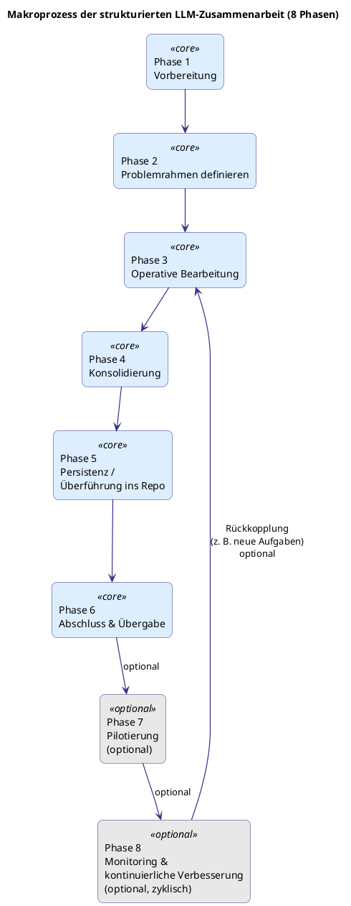

# Makroprozess der strukturierten LLM-Zusammenarbeit

Dieses Dokument beschreibt den übergeordneten Makroprozess für komplexe, strukturierte Arbeiten mit einem LLM.  
Er definiert die übergreifenden Phasen, Ziele, Übergänge und Kernaktivitäten.

Die hier beschriebenen Phasen sind die Grundlage für alle weiteren Methoden-Bausteine.

## Executive Summary

Der Makroprozess beschreibt einen strukturierten Ablauf in **6 Kernphasen** (optional erweitert auf 8), mit dem komplexe Vorhaben gemeinsam mit einem LLM **über längere Zeiträume hinweg** konsistent, nachvollziehbar und reproduzierbar bearbeitet werden können.

Er ist speziell dafür entwickelt, Projekte und Themenkomplexe zu unterstützen, bei denen das LLM **kontinuierlich auf bereits gewonnenen Erkenntnissen aufbauen muss** — ohne dass diese im Verlauf verloren gehen, verwässern oder neu erarbeitet werden müssen.

Die Phasen stellen sicher, dass:

* das Projekt sauber vorbereitet wird,
* Problem, Ziele und Begriffe klar definiert sind,
* Inhalte iterativ und strukturiert erarbeitet werden,
* Ergebnisse konsolidiert und dauerhaft gesichert sind,
* Wissen über Wochen oder Monate hinweg stabil bleibt,
* und der Abschluss eindeutig dokumentiert erfolgt.

Optional ermöglichen **Pilotierung** und **Monitoring**, die Methode real zu testen und langfristig weiterzuentwickeln.

**Warum ist das nötig?**
Bei langfristiger LLM-Nutzung entstehen leicht Kontextdrift, Wissensverluste, Inkonsistenzen und unklare Zuständigkeiten. Der Makroprozess verhindert genau diese Probleme, indem er die Zusammenarbeit in klare, aufeinander aufbauende Schritte gliedert.

**Kernaussage:**

> Mit diesen Phasen wird die LLM-Zusammenarbeit auf lange Sicht kontrolliert, effizient und nachhaltig — und komplexe Projekte können reproduzierbar und mit stabilem Wissensstand über viele Iterationen hinweg durchgeführt werden.

## Inhaltsverzeichnis

- [Executive Summary](#executive-summary)
- [Phase 1 – Vorbereitung](#phase-1--vorbereitung)
- [Phase 2 – Problemrahmen definieren](#phase-2--problemrahmen-definieren)
- [Phase 3 – Operative Bearbeitung](#phase-3--operative-bearbeitung)
- [Phase 4 – Konsolidierung](#phase-4--konsolidierung)
- [Phase 5 – Persistenz / Überführung ins Repository](#phase-5--persistenz--%C3%BCberf%C3%BChrung-ins-repository) 
- [Phase 6 – Abschluss & Übergabe](#phase-6--abschluss--%C3%BCbergabe)
- [Phase 7 – Pilotierung (optional)](#phase-7--pilotierung) 
- [Phase 8 – Monitoring & kontinuierliche Verbesserung (optional)](#phase-8--monitoring--kontinuierliche-verbesserung)
- [Übergeordnete Zusammenhänge](#%C3%BCberordnete-zusammenh%C3%A4nge)
  - [Rollenübersicht (prozessübergreifend)](#rollen%C3%BCbersicht-prozess%C3%BCbergreifend)
  - [Visualisierung](#visualisierung)
- [Zusammenfassung und Fazit](#zusammenfassung-und-fazit)

## Phase 1 – Vorbereitung

Die Vorbereitungsphase legt das Fundament für eine strukturierte, nachvollziehbare und reproduzierbare Zusammenarbeit mit dem LLM.  
Sie definiert Zweck, Rahmen, Struktur und Arbeitsumgebung – bevor inhaltliche Arbeit beginnt.

### Ziel
Dieser Abschnitt beschreibt, was mit Abschluss der Phase 1 erreicht sein muss und welchen Zweck die Vorbereitungsarbeiten erfüllen.

| Ziel | Beschreibung |
|------|--------------|
| Fundament schaffen | Die organisatorischen, technischen und methodischen Voraussetzungen für eine geordnete, reproduzierbare und konsistente Zusammenarbeit mit dem LLM herstellen. |
| Klarheit schaffen | Ziel, Scope, Rollen, Arbeitsweise und Dokumentationsorte definieren. |
| Arbeitsfähigkeit sichern | Sicherstellen, dass Umgebung, Projektanweisung und Dokumentationsstruktur vollständig bereitstehen. |

### Input
Der Abschnitt listet alle Materialien, Informationen und Rahmenbedingungen auf, die benötigt werden, um Phase 1 erfolgreich durchzuführen.

| Kategorie | Beschreibung | Zweck / Warum relevant? | Beispiele |
|----------|--------------|--------------------------|-----------|
| Fachliche Ausgangslage | Erste Beschreibung dessen, was erreicht werden soll. Noch nicht detailliert, aber klar. | Dient als Ausgangspunkt für Problemrahmen und Strukturierung. | „Wir wollen eine Methodik für LLM-Zusammenarbeit entwickeln.“ |
| Grundlegender Kontext | Informationen über Personen, Umfeld, Rahmenbedingungen. | Ermöglicht korrekte thematische Einordnung durch das LLM. | Projektteam, Organisation, technische Rahmenbedingungen. |
| Dokumentationsumgebung | Ort der strukturierten, versionierten Wissenshaltung. | Verhindert Wissensverlust; ermöglicht Wiederverwendbarkeit. | GitHub-Repository, `docs/`-Struktur. |
| Projektanweisung | Kompakter, stabiler Steuerrahmen (Rollen, Format, Arbeitsregeln). | Sichert Konsistenz und verhindert Kontextdrift in späteren Phasen. | ChatGPT-Projektanweisung. |
| Vorhandene Materialien | Bestehende Notizen, Konzepte, früheres Wissen. | Liefert Orientierung und stellt Anschlussfähigkeit sicher. | Notes, Skizzen, frühere Prompts. |
| Ressourcen | Tools, Zugänge, Daten, Ansprechpartner. | Stellt operative Arbeitsfähigkeit sicher. | API-Zugänge, Browser, Repo-Zugriff, Rollen. |

### Output
Dieser Abschnitt zeigt, welche konkreten Ergebnisse am Ende von Phase 1 vorliegen müssen, um mit Phase 2 beginnen zu können.

| Output | Beschreibung | Zweck |
|--------|--------------|--------|
| Präzise Projektbeschreibung | Ziel, Scope, Motivation, Abgrenzung definiert. | Gemeinsames Verständnis herstellen. |
| Eingerichtetes LLM-Projekt | Projektanweisung hinterlegt, Struktur stabil. | Sicherer methodischer Rahmen. |
| Dokumentationsstruktur | Verzeichnisbaum, Dateien, Verantwortlichkeiten. | Ordnung und Nachvollziehbarkeit gewährleisten. |
| Arbeitsweise definiert | Iterationen, Rollen, Formatregeln, Rückfrageprinzip. | Klare Regeln für die Zusammenarbeit. |
| Initiale Issues | Strukturierte Aufgabenliste für Phase 1 → 2. | Planbarkeit und Orientierung. |
| Abschluss der Vorbereitung | Dokumentiert, dass Phase 1 vollständig erledigt ist. | Übergabe an Phase 2. |

### Rollen
Der Abschnitt beschreibt, welche Rollen in Phase 1 beteiligt sind, welche Verantwortung sie tragen und warum sie relevant sind.

| Rolle | Verantwortung | Bedeutung |
|-------|----------------|-----------|
| Auftraggeber / Projektverantwortlicher | Definiert Ziel, Scope und Rahmen. | Setzt die Leitplanken des Vorhabens. |
| LLM-Methodiker | Gestaltet Projektanweisung, Struktur, Arbeitsweise. | Sicherstellung der methodischen Qualität. |
| Dokumentationsverantwortlicher | Legt Repo-Struktur an, pflegt Dokumente. | Verhindert Wissensverlust. |
| Reviewer | Prüft Vollständigkeit, Konsistenz, Anschlussfähigkeit. | Qualitätssicherung der Grundlage. |

### Aktivitäten
Dieser Abschnitt beschreibt alle in Phase 1 durchzuführenden Schritte, die notwendig sind, um alle Outputs zu erzeugen.

| Aktivität | Beschreibung | Ergebnis |
|-----------|--------------|----------|
| Projektziel, Scope, Abgrenzung formulieren | Schriftlich festhalten und verständlich machen. | Einheitliches Verständnis. |
| LLM-Projekt einrichten | Projektanweisung definieren und hinterlegen. | Stabiler methodischer Kontext. |
| Dokumentationsstruktur anlegen | Verzeichnisse, Dateien, Basisdokumente erstellen. | Ordnung & Wiederauffindbarkeit der Inhalte. |
| Arbeitsweise definieren | Iterationen, Rollen, Formatvorgaben festlegen. | Strukturierte Zusammenarbeit. |
| Struktur-Issues anlegen | Alle nächsten Schritte als Issues erfassen. | Transparente Aufgabenplanung. |
| Review der Vorbereitung | Vollständigkeit prüfen, Lücken als Issues erfassen. | Phase 1 abgeschlossen. |

### Übergabepunkte
Dieser Abschnitt definiert die formalen Bedingungen, die erfüllt sein müssen, bevor Phase 2 beginnen kann.

| Übergabepunkt | Beschreibung |
|---------------|--------------|
| Basisdokumente vollständig | Mission & Scope, Projektanweisung, IA, Roadmap stehen. |
| Projektanweisung final | Steuerlogik ist kompakt, stabil und einsatzbereit. |
| Arbeitsweise geklärt | Rollen, Iterationen, Formatregeln sind definiert. |
| Repo-Struktur steht | Alle notwendigen Ordner und Dateien existieren. |
| Nächste Schritte als Issues | Klar definierte Aufgaben für Phase 2. |
| Übergang zu Phase 2 | Phase 1 formal abgeschlossen. |

### Beispiel

**Beispielhafte Durchführung von Phase 1 im Projekt `cher-llm-methodology`**

1. **Fachliche Ausgangslage**  
   Christoph möchte eine belastbare Methode entwickeln, wie komplexe Projekte strukturiert zusammen mit einem LLM durchgeführt werden können. Daraus entsteht die erste Formulierung für die Projektbeschreibung.

2. **Grundlegender Kontext**  
   Die Arbeit findet im GitHub-Repository `cher-llm-methodology` statt.  
   Zielgruppe sind Personen, die selbst mit LLMs an komplexen Vorhaben arbeiten, z. B. in IT-Management, Architektur, Compliance oder Softwareprojekten.

3. **Dokumentationsumgebung**  
   Das Repository wird angelegt, Basisdokumente (`mission-and-scope.md`, `information-architecture.md`) werden erstellt und die Ordnerstruktur definiert.

4. **Projektanweisung**  
   Im ChatGPT-Projekt wird eine kompakte, stabile Anweisung eingerichtet:  
   – Rollen: LLM-Methodiker, Strukturgeber, Reviewer  
   – Ausgabeformat: Markdown  
   – Arbeitsweise: iterative, klare Schritte, keine Ausschweifungen

5. **Vorhandene Materialien**  
   Frühere Erfahrungen aus mehreren Projekten (WebApp-Core, EU AI Act Tooling, SAP-ISA-M-Modelle) dienen als Orientierung, werden aber nicht direkt integriert.

6. **Ressourcen**  
   Zugriff auf GitHub, Browser, ChatGPT-Projekt, interne Notizen sind sichergestellt.

7. **Ergebnisse**  
   Ein funktionsfähiges Repository, definierte Arbeitsweise, klare Projektanweisung und eine initiale Roadmap bilden die Grundlage für Phase 2.

---

## Phase 2 – Problemrahmen definieren

In dieser Phase wird das Vorhaben so weit geschärft, dass das LLM in der operativen Bearbeitung präzise, konsistent und zielgerichtet arbeiten kann.  Es geht darum, das Problem einzugrenzen, zentrale Begriffe zu definieren und einen strukturierten Rahmen festzulegen.

### Ziel
Dieser Abschnitt beschreibt, was am Ende von Phase 2 erreicht sein muss: ein klar definierter, verständlicher und ausreichend präziser Problemrahmen.

| Ziel | Beschreibung |
|------|--------------|
| Problem eingrenzen | Präzise definieren, worum es *konkret* geht und was explizit nicht Teil des Vorhabens ist. |
| Begriffe klären | Zentrale Begriffe, Rollen und Konzepte definieren, um Missverständnisse zu vermeiden. |
| Arbeitsdimensionen festlegen | Welche Perspektiven, Fragestellungen oder Teilbereiche das Vorhaben strukturell umfasst. |
| Erwartetes Ergebnisbild skizzieren | Klar definieren, wie ein „gutes Ergebnis“ aussieht und wie es genutzt wird. |

### Input
Dieser Abschnitt zeigt, welche Informationen aus Phase 1 benötigt werden, damit ein sauber definiertes Problemprofil entstehen kann.

| Kategorie | Beschreibung | Zweck / Warum relevant? | Beispiele |
|-----------|--------------|--------------------------|-----------|
| Projektbeschreibung | Ergebnis aus Phase 1: Was soll erreicht werden? | Dient als Ausgangspunkt für die inhaltliche Schärfung. | „Methode für LLM-Zusammenarbeit entwickeln.“ |
| Kontext-Informationen | Rollen, Stakeholder, organisatorisches Umfeld. | Bestimmt, für wen das Ergebnis relevant sein muss. | Projektteam, Fachabteilung. |
| Erste Annahmen | Vermutungen, Hypothesen, mögliche Risiken. | Dient zur Strukturierung der Problemklärung. | „LLM-Kontextdrift ist ein Kernproblem.“ |
| Dokumentationsstruktur | Ablageort und Struktur aus Phase 1. | Verhindert Informationsverlust bei der Ausarbeitung. | `docs/processes/`, `docs/meta/`. |
| Projektanweisung | Steuerlogik aus Phase 1. | Sichert methodische Konsistenz der Ausarbeitung. | ChatGPT-Projektanweisung. |

### Output
Hier wird definiert, welche Ergebnisse am Ende der Phase vorliegen müssen, um mit der operativen Bearbeitung beginnen zu können.

| Output | Beschreibung | Zweck |
|--------|--------------|--------|
| Problemprofil | Präzise Beschreibung des Problems, seiner Grenzen und Hintergründe. | Grundlage für die operative Bearbeitung. |
| Abgrenzung | Dokumentierte Nicht-Ziele und Ausschlüsse. | Verhindert Scope-Creep. |
| Glossar / Begriffsdefinitionen | Zentrale Begriffe klar definiert. | Reduziert Missverständnisse im LLM-Dialog. |
| Strukturierungsachsen | Dimensionen, entlang derer später gearbeitet wird. | Bietet Orientierung für Struktur und Dokumente. |
| Qualitätskriterien | Definition, wann ein Ergebnis „gut genug“ ist. | Ermöglicht zielgerichtete Optimierung. |
| Übergabe an Phase 3 | Formale Bestätigung, dass Problemrahmen ausreichend ist. | Start der operativen Bearbeitung. |

### Rollen
Dieser Abschnitt erklärt, wer in dieser Phase beteiligt ist und welche Verantwortung besteht.

| Rolle | Verantwortung | Bedeutung |
|-------|----------------|-----------|
| Auftraggeber | Präzisiert Erwartungen und Abgrenzungen. | Sichert Relevanz und Zielausrichtung. |
| LLM-Methodiker | Schärft den problemorientierten Rahmen methodisch. | Garantiert klare Struktur. |
| Fachexperten | Stellen inhaltliche Klarheit sicher. | Vermeiden fachliche Fehlannahmen. |
| Reviewer | Prüft Lesbarkeit, Präzision und Konsistenz. | Qualitätssicherung. |

### Aktivitäten
Dieser Abschnitt beschreibt die wesentlichen Schritte, um einen vollständigen Problemrahmen zu erstellen.

| Aktivität | Beschreibung | Ergebnis |
|-----------|--------------|----------|
| Problem präzise formulieren | Was genau ist das Problem? Was nicht? | Klar abgegrenzte Aufgabenstellung. |
| Ziele operationalisieren | Was soll erreicht werden? Wie soll das Ergebnis aussehen? | Verständliches Zielbild. |
| Begriffe definieren | Glossar oder Definitionsliste erstellen. | Gemeinsame Sprache. |
| Dimensionen herausarbeiten | Strukturachsen festlegen (z. B. Prozess, Rollen, Artefakte). | Ordnung für die spätere Ausarbeitung. |
| Risiken/Annahmen erfassen | Frühzeitige Erkennung kritischer Punkte. | Vorbereitung für Phase 3. |
| Review & Freigabe | Prüfen, ob Problemrahmen vollständig und präzise ist. | Startsignal für Phase 3. |

### Übergabepunkte
Dieser Abschnitt definiert, welche Bedingungen erfüllt sein müssen, bevor Phase 3 beginnen kann.

| Übergabepunkt | Beschreibung |
|---------------|--------------|
| Problem klar formuliert | Kurz, präzise, verständlich. |
| Zielbild definiert | Erwartetes Ergebnis skizziert. |
| Abgrenzung dokumentiert | „Nicht-Ziele“ explizit festgehalten. |
| Glossar erstellt | Begriffe klar definiert. |
| Strukturierungsachsen festgelegt | Dimensionen, an denen Phase 3 sich orientiert. |
| Freigabe dokumentiert | Start der operativen Bearbeitung ist beschlossen. |

### Beispiel
Ein konkretes Beispiel aus dem Projekt „cher-llm-methodology“, das zeigt, wie Phase 2 aussieht.

**Beispielhafte Durchführung von Phase 2 im Projektkontext**

1. **Problem präzisieren**  
   Das Kernproblem wird formuliert:    „Komplexe Projekte verlieren im Verlauf der LLM-Nutzung an Struktur, Konsistenz und Nachvollziehbarkeit.“

2. **Zielbild definieren**  
   Erwartetes Ergebnis: „Eine reproduzierbare, dokumentierte Methodik, mit der Menschen gemeinsam mit einem LLM strukturiert an komplexen Problemen arbeiten können.“

3. **Abgrenzung festhalten**  
   Nicht umfasst sind:  
   - technische Modellvergleiche  
   - regulatorische oder ethische KI-Bewertungen  
   - Implementierungsdetails einzelner Softwareprojekte

4. **Glossar erstellen**  
   Wichtige Begriffe wie „Makroprozess“, „Projektanweisung“, „Konsolidierung“, „Kontextdrift“ werden definiert.

5. **Strukturierungsachsen festlegen**  
   - Prozessebene (Phasen, Übergänge)  
   - Rollenebene (Methodiker, Reviewer, Dokumentierende)  
   - Artefakte (Dokumente, Chat-Strukturen, Issues)

6. **Freigabe**  
   Die Problemdefinition ist akzeptiert und dient als Grundlage für Phase 3 – operative Bearbeitung.

---

## Phase 3 – Operative Bearbeitung

In dieser Phase findet die eigentliche Zusammenarbeit mit dem LLM statt. Die zuvor definierten Strukturen, Begriffe und Ziele werden operationalisiert und genutzt, um Inhalte zu erarbeiten, Entscheidungen vorzubereiten oder Artefakte zu erzeugen. Die Phase ist iterativ aufgebaut und bildet das Herzstück des LLM-gestützten Arbeitens.

### Ziel
Dieser Abschnitt beschreibt, was am Ende der operativen Phase erreicht sein muss: konkrete inhaltliche Ergebnisse, die strukturiert, nachvollziehbar und konsistent sind.

| Ziel | Beschreibung |
|------|--------------|
| Inhalte erarbeiten | Auf Basis des definierten Problemrahmens konkrete Ergebnisse erzeugen. |
| Struktur sichern | Vorgehen, Begriffsverwendung und Arbeitsmethoden konsistent halten. |
| Iterativ verfeinern | Ergebnisse in mehreren Schleifen verbessern, konkretisieren und vereinheitlichen. |
| Entscheidungsfähigkeit herstellen | Ergebnisse so vorbereiten, dass Konsolidierung und Persistenz möglich werden. |

### Input
Dieser Abschnitt zeigt, was zu Beginn der operativen Phase vorliegen muss, um effektiv arbeiten zu können.

| Kategorie | Beschreibung | Zweck / Warum relevant? | Beispiele |
|----------|--------------|--------------------------|-----------|
| Problemrahmen | Ergebnis von Phase 2 – klar definiertes Problem, Zielbild, Abgrenzungen. | Richtet die operative Arbeit aus. | Problemprofil, Zielbild. |
| Glossar / Begriffe | Definierte Terminologie. | Verhindert Missverständnisse im LLM-Dialog. | Begriffsdefinitionen, Rollenbegriffe. |
| Strukturierungsachsen | Dimensionen, entlang derer gearbeitet wird. | Ordnet Inhalte und fördert Konsistenz. | Prozess, Rollen, Artefakte. |
| Projektanweisung | Steuerlogik des LLM-Projekts. | Hält Format, Arbeitsweise und Rollen stabil. | Output-Standards, Iterationslogik. |
| Repository-Struktur | Ablageorte, Dokumentation, Versionierung. | Sichert Nachvollziehbarkeit und Wiederverwendbarkeit. | `docs/processes/`, `docs/concepts/`. |
| Offene Issues | Aufgaben aus Phase 2. | Strukturieren konkrete Arbeitsschritte. | „Makroprozess erstellen“, „Terminologie festlegen“. |

### Output
Dieser Abschnitt definiert die Ergebnisse, die am Ende der operativen Phase vorliegen müssen, bevor konsolidiert wird.

| Output | Beschreibung | Zweck |
|--------|--------------|--------|
| Entwürfe / Arbeitsartefakte | Erste oder fortgeschrittene Versionen von Dokumenten, Modellen, Prozessen. | Grundlage für Konsolidierung. |
| Strukturierte Zwischenstände | Klar gegliederte Ergebnisse, Zwischenpublikationen, Skizzen. | Erleichtert Review & Konsolidierung. |
| Entscheidungen / Varianten | Abgewogene Optionen, Empfehlungen, Vorentscheidungen. | Bereitet formale Konsolidierung vor. |
| Iterationshistorie | Dokumentation des Vorgehens, inkl. Chat-Ausschnitten oder Issues. | Nachvollziehbarkeit und Revisionssicherheit. |
| Offene Fragepunkte | Bereiche, die bewusst später geklärt werden sollen. | Fokus auf das Wesentliche, Vermeidung von Blockaden. |
| Übergabe an Phase 4 | Sämtliche relevanten Inhalte liegen in konsolidierbarer Form vor. | Start der Konsolidierungsphase. |

### Rollen
Dieser Abschnitt erläutert, welche Rollen in der operativen Arbeit beteiligt sind und welche Aufgaben sie haben.

| Rolle | Verantwortung | Bedeutung |
|-------|----------------|-----------|
| LLM-Methodiker | Moderiert die Zusammenarbeit, stellt Struktur sicher. | Gewährleistet Konsistenz und methodische Qualität. |
| Fachexperten | Liefern inhaltliches Fachwissen. | Sichern inhaltliche Korrektheit. |
| Reviewer | Prüfen Entwürfe regelmäßig. | Frühzeitige Qualitätssicherung. |
| Dokumentationsverantwortlicher | Überträgt relevante Ergebnisse ins Repository. | Verhindert Wissensverlust. |

### Aktivitäten
Dieser Abschnitt beschreibt die operativen Schritte, mit denen die Inhalte erzeugt und verfeinert werden.

| Aktivität | Beschreibung | Ergebnis |
|-----------|--------------|----------|
| Iterative Erstellung | Inhalte in mehreren Schleifen gemeinsam mit dem LLM entwickeln. | Erste und fortgeschrittene Versionen. |
| Strukturprüfungen | Regelmäßige Überprüfung gegen Problemrahmen, Glossar, Strukturachsen. | Konsistente Ergebnisse. |
| Variantenbildung | Unterschiedliche Ansätze/Modelle erzeugen und vergleichen. | Fundierte Entscheidungsgrundlage. |
| Deep Dives | Vertiefte Ausarbeitungen einzelner Aspekte. | Detaillierte Inhalte. |
| Rückfragenklären | Unklare Anforderungen identifizieren und präzisieren. | Eliminierung von Ambiguitäten. |
| Dokumentation | Ergebnisse strukturiert festhalten, Zwischenstände sichern. | Ordnung & Nachvollziehbarkeit. |
| Übergabe vorbereiten | Ergebnisse aufbereiten, offene Punkte markieren. | Klarer Übergang zu Phase 4. |

### Übergabepunkte
Dieser Abschnitt definiert die Kriterien, die erfüllt sein müssen, bevor konsolidiert werden kann.

| Übergabepunkt | Beschreibung |
|---------------|--------------|
| Ergebnisse erzeugt | Alle notwendigen Inhalte für die Konsolidierung liegen vor. |
| Struktur eingehalten | Problemrahmen, Glossar, Format- und Strukturvorgaben wurden beachtet. |
| Varianten bewertet | Entscheidungsvorbereitung erfolgt oder Varianten klar dokumentiert. |
| Offene Punkte markiert | Klar ersichtlich, was noch geklärt oder ergänzt wird. |
| Repository aktualisiert | Zwischenstände korrekt abgelegt. |
| Freigabe dokumentiert | Phase 3 ist abgeschlossen, Phase 4 kann starten. |

### Beispiel

Ein konkretes Beispiel aus der Arbeit an der „cher-llm-methodology“.

**Beispielhafte Durchführung von Phase 3 im Projektkontext**

1. **Makroprozess-Struktur entsteht**  
   In mehreren Iterationen erarbeitet das Team zusammen mit dem LLM die Grundstruktur der acht Phasen.

2. **Tabellenmodelle werden entwickelt**  
   Für Phase 1 und 2 werden tabellarische Darstellungen mit klaren Einleitungen erstellt. Das LLM liefert Vorschläge, der Mensch steuert, priorisiert und verfeinert.

3. **Glossar und Begriffsdefinitionen werden verwendet**  
   Begriffe wie „Projektanweisung“, „Konsolidierung“, „Iterationenprinzip“ werden konsistent genutzt.

4. **Varianten diskutiert**  
   Das Team prüft, ob 6 oder 8 Phasen sinnvoll sind und entscheidet sich für eine kombinierte Struktur inklusive Pilotierung und Monitoring.

5. **Dokumente entstehen**  
   - `process-macro.md` bekommt erste gefüllte Abschnitte  
   - Roadmaps und Issue-Listen werden aktualisiert  
   - Strukturachsen (Phasen, Rollen, Artefakte) werden ergänzt

6. **Übergabereife erreicht**  
   Die Ergebnisse sind konsistent genug, um in Phase 4 – Konsolidierung überführt zu werden.

--- 

## Phase 4 – Konsolidierung

In dieser Phase werden die in der operativen Arbeit entstandenen Inhalte strukturiert überprüft, verdichtet und zu konsistenten, anschlussfähigen Ergebnissen zusammengeführt. Ziel ist es, aus Entwürfen und iterativen Fragmenten ein stimmiges, widerspruchsfreies Gesamtbild zu erzeugen, das als Basis für die finale Persistenz dienen kann.

### Ziel
Dieser Abschnitt beschreibt den Zweck der Konsolidierung und was am Ende dieser Phase erreicht sein muss.

| Ziel | Beschreibung |
|------|--------------|
| Ergebnisse vereinheitlichen | Inhalte aus der operativen Phase konsistent zusammenführen. |
| Widersprüche auflösen | Unstimmigkeiten, Doppelungen oder logische Lücken bereinigen. |
| Struktur finalisieren | Gliederungen, Begriffe und Zusammenhänge präzise aufeinander abstimmen. |
| Entscheidungsreife herstellen | Klar definieren, welche Inhalte final, welche noch offen und welche verworfen sind. |

### Input
Hier wird aufgeführt, welche Materialien und Vorleistungen aus Phase 3 benötigt werden.

| Kategorie | Beschreibung | Zweck / Warum relevant? | Beispiele |
|----------|--------------|--------------------------|-----------|
| Arbeitsartefakte | Entwürfe, Modelle, Texte und Varianten aus der operativen Bearbeitung. | Grundlage für Vereinheitlichung. | Tabellen, Prozesselemente, Definitionssammlungen. |
| Varianten & Entscheidungen | Getroffene Vorentscheidungen, alternative Lösungswege. | Identifikation der finalen Linie. | Prozessvarianten, Modellierungsoptionen. |
| Offene Fragen | Punkte, die während der operativen Phase bewusst nicht geklärt wurden. | Sicherstellung, dass nichts verloren geht. | TODO-Listen, markierte Stellen. |
| Glossar & Strukturachsen | Bestehende Definitions- und Strukturgrundlagen. | Hilft, Konsistenz zu prüfen. | Begriffssets, Phasenachsen, Rollen. |
| Projektanweisung | Regelt Format, Arbeitsweise und Qualitätsstandards. | Richtet die Konsolidierung an bestehenden Vorgaben aus. | Ausgabeformatregeln. |
| Repository-Struktur | Orte, an denen die konsolidierten Inhalte abgelegt werden. | Sichert Auffindbarkeit und Versionierung. | `docs/processes/`, `docs/concepts/`. |

### Output
Dieser Abschnitt definiert, welche finalen Zwischenergebnisse am Ende der Phase erreicht sein müssen.

| Output | Beschreibung | Zweck |
|--------|--------------|--------|
| Konsolidierte Inhalte | Einheitliche, fehlerbereinigte und vollständige Versionen aller relevanten Ergebnisse. | Grundlage für Persistenz. |
| Finale Struktur | Bereinigte Kapitel, klare Prozessbeschreibungen, konsistente Tabellen. | Nachvollziehbarkeit und Anschlussfähigkeit. |
| Dokumentierte Entscheidungen | Klar dokumentiert, warum welche Variante gewählt oder verworfen wurde. | Transparenz und Revisionssicherheit. |
| Offene Restpunkte | Liste der Punkte, die bewusst erst später (z. B. Phase 7/8) adressiert werden. | Fokus behalten. |
| Freigabe zur Persistenz | Phase 4 ist abgeschlossen und Inhalte können in Phase 5 überführt werden. | Startschuss für die Persistenzphase. |

### Rollen
Dieser Abschnitt zeigt, welche Rollen für die Konsolidierung verantwortlich sind.

| Rolle | Verantwortung | Bedeutung |
|-------|----------------|-----------|
| LLM-Methodiker | Führt strukturierte Konsolidierung durch, synchronisiert Inhalte. | Sicherstellung der methodischen Qualität. |
| Reviewer | Prüft Konsistenz, Vollständigkeit, logische Stringenz. | Qualitätssicherung vor Persistenz. |
| Fachexperten | Klären inhaltliche Fragen, prüfen fachliche Korrektheit. | Verhindert fachliche Fehler. |
| Dokumentationsverantwortlicher | Bereitet finale Dokumentation für die Persistenz auf. | Verhindert Informationsverlust. |

### Aktivitäten
Dieser Abschnitt beschreibt, wie die Konsolidierung praktisch abläuft.

| Aktivität | Beschreibung | Ergebnis |
|-----------|--------------|----------|
| Sammlung aller Artefakte | Alle relevanten Inhalte aus Phase 3 werden zusammengetragen. | Vollständige Datenbasis. |
| Konsistenzprüfung | Prüfung auf Widersprüche, Redundanzen, logische Brüche. | Einheitlicher, verständlicher Inhalt. |
| Strukturangleichung | Inhalte werden entlang der definierten Strukturachsen harmonisiert. | Klar gegliederte Ergebnisstruktur. |
| Variantenentscheidung dokumentieren | Transparente Festlegung der finalen Vorgehensweise. | Nachvollziehbare Entscheidungen. |
| Lücken schließen | Offene oder unklare Stellen werden ergänzt oder präzisiert. | Vollständige Inhalte. |
| Vorbereitung der Persistenz | Inhalte final ordnen, benennen, bereitstellen. | Übergabereife erreicht. |

### Übergabepunkte
Dieser Abschnitt beschreibt, wann die Konsolidierung abgeschlossen ist und die nächste Phase starten kann.

| Übergabepunkt | Beschreibung |
|---------------|--------------|
| Inhalte final konsolidiert | Keine widersprüchlichen oder unklaren Abschnitte vorhanden. |
| Struktur harmonisiert | Kapitel, Tabellen und Definitionen sind konsistent aufeinander abgestimmt. |
| Entscheidungen dokumentiert | Gewählte Varianten und Begründungen sind festgehalten. |
| Offene Restpunkte markiert | Klar ersichtlich, was später zu bearbeiten ist. |
| Repository vorbereitet | Dateien und Ordner sind für die Persistenz strukturiert. |
| Freigabe erfolgt | Phase 4 gilt offiziell als abgeschlossen. |

### Beispiel

Ein konkretes Beispiel aus dem Projekt „cher-llm-methodology“.

**Beispielhafte Durchführung von Phase 4 im Projektkontext**

1. **Sammlung aller Artefakte**  
   Alle Tabellen und Einleitungstexte aus Phase 1–3 werden zusammengetragen und gegenübergestellt.

2. **Harmonisierung der Struktur**  
   Die Struktur wird vereinheitlicht:  
   - gleiche Tabellenformate  
   - gleiche Benennung der Abschnitte  
   - gleiche Satzlängen und Formulierungsprinzipien

3. **Bereinigung von Redundanzen**  
   Doppelte Erklärungen zu Glossar, Strukturachsen oder Rollen werden reduziert und in zentralen Abschnitten gebündelt.

4. **Entscheidungen festhalten**  
   Es wird dokumentiert, warum das Modell mit 8 Phasen (inkl. Pilotierung und Monitoring) gewählt wurde — und nicht mit 6 oder 7.

5. **Lücken schließen**  
   An einigen Stellen (z. B. Glossar, Rollenbeschreibung) werden noch fehlende Klarstellungen ergänzt.

6. **Persistenz vorbereiten**  
   Die Inhalte werden in definierte Dateien überführt, Titel werden vereinheitlicht, Abschnittsreihenfolgen fixiert.

7. **Freigabe**  
   Die Phase ist abgeschlossen – die konsolidierten Inhalte können in `docs/processes/` finalisiert und versioniert werden.

--- 

## Phase 5 – Persistenz / Überführung ins Repository

In dieser Phase werden die konsolidierten Inhalte final und dauerhaft in das Repository überführt.  
Ziel ist eine stabile, versionierte und nachvollziehbare Dokumentation, die unabhängig vom Chat-Verlauf nutzbar bleibt.  
Die Persistenz dient als „Single Source of Truth“ und schützt Ergebnisse vor Kontextverlust, Drift oder Überschreibung.

### Ziel
Dieser Abschnitt beschreibt, was am Ende dieser Phase erreicht sein muss: stabile, versionierte und öffentlich oder intern nutzbare Dokumente.

| Ziel | Beschreibung |
|------|--------------|
| Ergebnisse dauerhaft sichern | Konsolidierte Inhalte werden final ins Repository überführt. |
| Versionierung herstellen | Ergebnisse werden sauber versioniert und dokumentiert. |
| Nachvollziehbarkeit sichern | Änderungen und Entscheidungen werden nachvollziehbar abgelegt. |
| Wiederverwendbarkeit ermöglichen | Ergebnisse sind klar strukturiert und unabhängig vom Chat nutzbar. |
| Operationalisierung unterstützen | Dokumentation ist so gestaltet, dass andere sie direkt anwenden können. |

### Input
Dieser Abschnitt beschreibt, welche Vorleistungen aus Phase 4 benötigt werden, damit Persistenz erfolgen kann.

| Kategorie | Beschreibung | Zweck / Warum relevant? | Beispiele |
|----------|--------------|--------------------------|-----------|
| Konsolidierte Inhalte | Finale Versionen aller Dokumente, Tabellen, Definitionen. | Grundlage für Persistenz. | Makroprozess-Tabellen, Glossar, Strukturachsen. |
| Strukturierte Ablageorte | Definierte Verzeichnisstruktur aus Phase 1. | Sichert Ordnung und Auffindbarkeit. | `docs/processes/`, `docs/meta/`. |
| Dokumentierte Entscheidungen | Begründungen für Varianten und Strukturentscheidungen. | Erhöht die Nachvollziehbarkeit. | Entscheidungstabellen, Commit-Notizen. |
| Offene Restpunkte | Markierte Punkte, die später adressiert werden. | Verhindert, dass unfertige Inhalte verloren gehen. | Issue-Liste für spätere Phasen. |
| Repository-Standards | Regeln für Dateiformate, Naming, Commit-Nachrichten. | Sicherstellung konsistenter Ablage. | README-Anforderungen, Conventions. |

### Output
Dieser Abschnitt definiert, was das Ergebnis der Persistenzphase ist.

| Output | Beschreibung | Zweck |
|--------|--------------|--------|
| Finalisierte Dokumente | Ergebnisse liegen in klarer, versionierter Form vor. | „Single Source of Truth“ für das Projekt. |
| Commit-Historie | Versionierte Änderungen mit klaren Commit-Messages. | Revisionssicherheit. |
| Veröffentlichte Artefakte | Falls relevant: Artefakte auf GitHub Pages, Wiki oder Releases. | Nutzbarkeit für Dritte. |
| Aktualisierte Issues | Offene Punkte dokumentiert oder geschlossen. | Transparenz und Planbarkeit. |
| Freigabe für Phase 6 | Persistenzphase ist abgeschlossen und übergabefähig. | Start der Abschlussphase. |

### Rollen
Dieser Abschnitt beschreibt, wer für welche Aufgaben in der Persistenz verantwortlich ist.

| Rolle | Verantwortung | Bedeutung |
|-------|----------------|-----------|
| Dokumentationsverantwortlicher | Überträgt konsolidierte Inhalte ins Repository. | Verhindert Wissensverlust. |
| LLM-Methodiker | Prüft, ob Inhalte korrekt und vollständig übertragen wurden. | Sichert methodische Integrität. |
| Reviewer | Prüft Qualität, Formate, Struktur. | Abschlusskontrolle vor finaler Freigabe. |
| Projektverantwortlicher | Gibt Persistenz final frei. | Stellt sicher, dass Inhalte dem Projektziel entsprechen. |

### Aktivitäten
Dieser Abschnitt beschreibt den praktischen Ablauf der Überführung.

| Aktivität | Beschreibung | Ergebnis |
|-----------|--------------|----------|
| Dateien anlegen/aktualisieren | Inhalte in die richtigen Verzeichnisse übertragen. | Vollständige, saubere Dokumentation. |
| Struktur prüfen | Einheitliche Dateinamen, saubere Formatierung, klare Übersicht. | Konsistenter Repository-Aufbau. |
| Committen & Versionieren | Commits mit klaren, technischen Nachrichten erstellen. | Revisionssicherheit. |
| ggf. Release setzen | Bei größeren Milestones ein GitHub-Release anlegen. | Offizielle Publikation. |
| Wiki / Pages aktualisieren | Falls genutzt: Publikation außerhalb des `docs/`-Ordners. | Breiter zugängliche Ergebnisse. |
| Issues aktualisieren | Offene Punkte schließen, neue Aufgaben erfassen. | Ordnung und Transparenz. |

### Übergabepunkte
Dieser Abschnitt definiert, wann Phase 5 abgeschlossen ist.

| Übergabepunkt | Beschreibung |
|---------------|--------------|
| Inhalte final im Repository | Strukturierte Dokumente liegen vollständig vor. |
| Commit-Historie sauber | Relevante Änderungen versioniert mit aussagekräftigen Nachrichten. |
| Keine logischen Lücken | Konsolidierung ist korrekt und vollständig persistiert. |
| Restpunkte dokumentiert | Offene Punkte als Issues erfasst. |
| Veröffentlichung erfolgt | Inhalte liegen nutzbar und abrufbar vor. |
| Freigabe dokumentiert | Übergang zu Phase 6 bestätigt. |

### Beispiel

Ein konkretes Beispiel aus dem Projekt „cher-llm-methodology“.

**Beispielhafte Durchführung von Phase 5 im Projektkontext**

1. **Repositoriumsstruktur wird genutzt**  
   Die konsolidierten Prozessbeschreibungen aus Phase 4 werden in die zugehörigen Unterordner (`docs/processes/`) übertragen.

2. **Dateien final formatiert**  
   Tabellen für Phase 1–4 werden vereinheitlicht (gleiche Markdown-Struktur, gleiche Spaltenlogik).

3. **Commit & Versionierung**  
   Für jede neue oder aktualisierte Datei wird ein klarer Commit erstellt, z. B.:  
   `Add consolidated version of process-macro.md (Phases 1–4)`

4. **Teilergebnis als v0.2 markiert**  
   Ein Release wird erstellt, das den Stand des Makroprozesses dokumentiert.

5. **Wiki/Praxisleitfäden aktualisiert**  
   Eine vereinfachte Version der Makroprozessphasen wird ins Wiki übernommen.

6. **Issues aktualisiert**  
   - Aus Phase 4 offene Punkte werden in eigene Issues überführt.  
   - Das Issue „Persistenz vorbereiten“ wird geschlossen.

7. **Freigabe durch Projektverantwortlichen**  
   Persistenz ist abgeschlossen – das Projekt kann in Phase 6 übergehen.

--- 

## Phase 6 – Abschluss & Übergabe

In dieser Phase wird das Projekt oder Teilprojekt formal abgeschlossen. Die erarbeiteten Inhalte werden final geprüft, übergeben und dokumentiert. Ziel ist es, sicherzustellen, dass die Ergebnisse klar abgeschlossen, nachvollziehbar und übergabefähig sind – sei es an ein anderes Team, an eine nachfolgende Phase, oder an die spätere Pilotierung bzw. den operativen Einsatz.

### Ziel
Dieser Abschnitt beschreibt, was am Ende der Abschlussphase erreicht sein muss.

| Ziel | Beschreibung |
|------|--------------|
| Projektformalitäten abschließen | Das Projekt (oder ein Teilprojekt) wird verbindlich abgeschlossen. |
| Ergebnisse übergeben | Finalisierte Inhalte werden an Stakeholder, Folgeprojekte oder Nutzer übergeben. |
| Dokumentation sichern | Abschluss- und Übergabedokumentation bereitstellen. |
| Transparenz herstellen | Klar kommunizieren, was erreicht wurde – und was bewusst offen bleibt. |
| Grundlage für spätere Pilotierung schaffen | Ergebnisse sind nutzbar für Phase 7 (Pilotierung) oder Phase 8 (Monitoring). |

### Input
Dieser Abschnitt zeigt, was aus Phase 5 (Persistenz) vorliegen muss.

| Kategorie | Beschreibung | Zweck / Warum relevant? | Beispiele |
|----------|--------------|--------------------------|-----------|
| Finalisierte Repository-Inhalte | Persistierte Versionen aller Ergebnisse. | Grundlage für Abschluss und Übergabe. | Finales `process-macro.md`, Glossar, Strukturen. |
| Commit- & Release-Historie | Dokumentierte Versionierung. | Nachvollziehbarkeit der Entwicklung. | Release v0.2, Commit-Liste. |
| Restpunkte | Offene, bewusst nicht umgesetzte Aspekte. | Klarheit über offenen Bedarf. | Issue-Liste „Open Questions“. |
| Entscheidungsdokumentation | Warum wurden bestimmte Varianten gewählt? | Transparenz und spätere Rückverfolgbarkeit. | Entscheidungslog, Architekturvarianten. |
| Stakeholder-Anforderungen | Erwartungen an Übergabe und Abschluss. | Sicherstellung der Abnahme. | Fachabteilung, Projektleitung. |

### Output
Der Abschnitt definiert, was konkret am Ende der Abschlussphase erzeugt werden muss.

| Output | Beschreibung | Zweck |
|--------|--------------|--------|
| Abschlussdokument | Zusammenfassung des Erreichten, inkl. Entscheidungen und Ergebnissen. | Verständlichkeit für Stakeholder. |
| Übergabepaket | Alle relevanten Dokumente, Strukturen und Links. | Direkte Nutzung der Ergebnisse. |
| Kommunikationsartefakte | Stakeholder-Updates, Changelogs, Release Notes. | Transparente Kommunikation. |
| Aktualisierte oder geschlossene Issues | Offene Punkte sind dokumentiert oder abgeschlossen. | Ordnung und Klarheit. |
| Freigabe & Abnahme | Formale Bestätigung über den Abschluss. | Grundlage für Phase 7 oder Projektende. |

### Rollen
Dieser Abschnitt zeigt, wer in dieser Phase beteiligt ist.

| Rolle | Verantwortung | Bedeutung |
|-------|----------------|-----------|
| Projektverantwortlicher | Gibt Abschluss frei, kommuniziert Ergebnisse. | Verantwortet Gesamtprojekt. |
| LLM-Methodiker | Sicherstellt, dass der methodische Anspruch erfüllt ist. | Qualität & Struktur. |
| Dokumentationsverantwortlicher | Kuratierte und finalisiert Dokumente. | Vollständigkeit der Dokumentation. |
| Reviewer | Prüft Abschlussartefakte. | Qualitätssicherung. |
| Stakeholder | Nehmen Ergebnisse entgegen, geben Feedback. | Nutzung der Ergebnisse. |

### Aktivitäten
Dieser Abschnitt beschreibt, wie die Abschlussphase praktisch abläuft.

| Aktivität | Beschreibung | Ergebnis |
|-----------|--------------|----------|
| Final Review | Letzte Prüfung der Inhalte auf Konsistenz, Vollständigkeit und Qualität. | Abnahmefähige Dokumente. |
| Übergabepaket schnüren | Zusammenstellung aller relevanten Materialien. | Strukturierte Übergabe. |
| Abschlussdokumentation erstellen | Zusammenfassung des Projektverlaufs und der Resultate. | Transparenz und Nachvollziehbarkeit. |
| Kommunikation | Stakeholder informieren, Release Notes erzeugen. | Klarer Abschluss. |
| Issues bearbeiten | Offene Issues schließen oder neu priorisieren. | Ordnung & Zukunftsorientierung. |
| Offizielle Freigabe | Dokumentation der Projektabnahme. | Übergang in Phase 7/8 oder Projektende. |

### Übergabepunkte
Dieser Abschnitt definiert, wann Phase 6 abgeschlossen ist.

| Übergabepunkt | Beschreibung |
|---------------|--------------|
| Abschlussdokument vorliegend | Zusammenfassung + Entscheidungen dokumentiert. |
| Alle relevanten Ergebnisse persistiert | Repository vollständig und final. |
| Übergabepaket bereitgestellt | Alle Stakeholder können die Ergebnisse nutzen. |
| Kommunikation erfolgt | Stakeholder informiert, Release Notes erstellt. |
| Offene Punkte dokumentiert | Klar definierte Restpunkte für spätere Phasen. |
| Freigabe erfolgt | Abschluss ist formal bestätigt. |

### Beispiel

Ein konkretes Beispiel aus dem Projekt „cher-llm-methodology“.

**Beispielhafte Durchführung von Phase 6 im Projektkontext**

1. **Final Review**  
   Alle Prozessphasen (1–6) werden noch einmal überprüft: Struktur, Tabellen, Einleitungen, Konsistenz mit der Informationsarchitektur.

2. **Erstellung eines Übergabepakets**  
   Enthält u. a.:  
   - finalisiertes `process-macro.md`  
   - zugehörige Meta- und Begleitdokumente  
   - Glossar / Terminologie  
   - Roadmap-Aktualisierung  
   - Referenzen auf Issues und Versionsstände

3. **Release Notes erzeugen**  
   Ein Release „v0.3 – Makroprozess initial abgeschlossen“ wird erstellt.

4. **Stakeholder-Kommunikation**  
   Projektverantwortlicher und Methodiker kommunizieren die fertige Struktur und den Nutzen für künftige Arbeiten.

5. **Issues aktualisieren**  
   - „Makroprozess definieren“ → geschlossen  
   - „Feintuning Phase 3/4“ → neu priorisiert  
   - „Pilotierung vorbereiten“ → neu angelegt

6. **Offizielle Freigabe**  
   Der Projektverantwortliche bestätigt den Abschluss von Phase 6, damit die Ergebnisse in Phase 7 (Pilotierung) operational genutzt werden können.

--- 

## Phase 7 – Pilotierung

In dieser optionalen Phase wird das Ergebnis des Projekts erstmals in einer realen Anwendungssituation getestet.  Ziel ist es, die erarbeitete Methode, Struktur oder das Artefakt unter echten Bedingungen einzusetzen, um Wirksamkeit, Praxistauglichkeit und mögliche Schwachstellen sichtbar zu machen.

### Ziel
Dieser Abschnitt beschreibt, was mit einer Pilotierung erreicht werden soll.

| Ziel | Beschreibung |
|------|--------------|
| Reale Anwendbarkeit testen | Überprüfung, ob die Methode in der Praxis wie geplant funktioniert. |
| Schwachstellen identifizieren | Herausfinden, wo Unklarheiten, Lücken oder Probleme bestehen. |
| Validierung sicherstellen | Bewerten, ob Ergebnisse robust und übertragbar sind. |
| Verbesserungspunkte ableiten | Konkrete Vorschläge zur Optimierung gewinnen. |
| Entscheidung vorbereiten | Festlegen, ob Methode übernommen, angepasst oder verworfen wird. |

### Input
Dieser Abschnitt zeigt, was aus Phase 6 benötigt wird.

| Kategorie | Beschreibung | Zweck / Warum relevant? | Beispiele |
|-----------|--------------|--------------------------|-----------|
| Finalisierte Inhalte | Ergebnisse aus Phase 6, die pilotiert werden sollen. | Grundlage der Erprobung. | `process-macro.md`, Glossar, Roadmap. |
| Übergabepaket | Dokumente, Links, Strukturübersichten. | Sichert vollständige Testbasis. | ZIP/Ordnerstruktur, Release v0.3. |
| Pilotplan | Definition des Umfangs: Szenarien, Dauer, Zielgruppe. | Strukturierter Ablauf der Pilotierung. | „Pilotierung in kleinem Team über 2 Wochen.“ |
| Erfolgskriterien | Kriterien, wann der Pilot als erfolgreich gilt. | Objektive Bewertungsgrundlage. | „Verständlichkeit“, „Anwendbarkeit“, „Nutzerfeedback“. |
| Stakeholder-Kontext | Wer pilotiert die Methode und warum. | Sichert Relevanz der Erprobung. | IT-Architekten, Projektleiter, Autoren. |

### Output
Dieser Abschnitt definiert die Ergebnisse, die am Ende der Pilotierung vorliegen müssen.

| Output | Beschreibung | Zweck |
|--------|--------------|--------|
| Pilotbericht | Dokumentation der Ergebnisse, Erfahrungen und Erkenntnisse. | Grundlage für Optimierung oder Freigabe. |
| Identifizierte Schwachstellen | Konkrete Probleme oder Unklarheiten. | Basis für Phase 8 oder erneute Konsolidierung. |
| Validierte Inhalte | Bestätigte Elemente der Methode. | Vertrauensbasis für Einsatz. |
| Änderungsvorschläge | Empfehlungen für Anpassungen. | Verbesserungspotenzial sichtbar machen. |
| Entscheidungsvorlage | Übernahme, Anpassung oder Ablehnung der Methode. | Grundlage für Stakeholder-Entscheidung. |

### Rollen
Dieser Abschnitt beschreibt die Beteiligten in der Pilotphase.

| Rolle | Verantwortung | Bedeutung |
|-------|----------------|-----------|
| Pilotanwender (Fachexperten) | Setzen Methode im realen Kontext ein. | Praktische Rückmeldungen. |
| LLM-Methodiker | Beobachtet, moderiert, analysiert Ergebnisse. | Sicherstellung der methodischen Qualität. |
| Projektverantwortlicher | Bewertet Pilotbericht und trifft Entscheidung. | Strategische Verantwortung. |
| Reviewer | Prüft Erkenntnisse und Empfehlungen. | Qualitätssicherung der Ableitungen. |

### Aktivitäten
Dieser Abschnitt beschreibt den praktischen Ablauf der Pilotierung.

| Aktivität | Beschreibung | Ergebnis |
|-----------|--------------|----------|
| Pilot-Scope definieren | Umfang, Szenarien, Rollen festlegen. | Klarer Rahmen. |
| Pilot durchführen | Methode real anwenden und beobachten. | Praxisergebnisse. |
| Feedback einsammeln | Strukturierte Rückmeldungen der Pilotanwender. | Qualitative und quantitative Erkenntnisse. |
| Probleme klassifizieren | Schwachstellen, Risiken, Missverständnisse dokumentieren. | Transparente Problemübersicht. |
| Empfehlungen ableiten | Konkrete Vorschläge für Anpassungen formulieren. | Grundlage für Phase 8. |
| Entscheidung vorbereiten | Abschließend bewerten, ob Methode übernommen wird. | Entscheidungsvorlage. |

### Übergabepunkte
Dieser Abschnitt definiert, wann die Pilotphase abgeschlossen ist.

| Übergabepunkt | Beschreibung |
|---------------|--------------|
| Pilotbericht erstellt | Ergebnisse und Erkenntnisse dokumentiert. |
| Schwachstellen analysiert | Probleme sauber beschrieben und kategorisiert. |
| Empfehlungen formuliert | Verbesserungen klar definiert. |
| Entscheidung vorbereitet | Übernahme/Anpassung/Verwerfung strukturiert. |
| Kommuniziert an Stakeholder | Ergebnisse sind allen relevanten Personen bekannt. |
| Freigabe erfolgt | Übergang in Phase 8 oder zurück zu Phase 3/4. |

### Beispiel

Ein konkretes Beispiel aus dem Projekt „cher-llm-methodology“.

**Beispielhafte Durchführung von Phase 7 im Projektkontext**

1. **Pilot-Scope definieren**  
   Die neue Makroprozess-Struktur (Phasen 1–8) wird in einem kleinen Team von 3 Personen pilotiert.  
   Szenario: „LLM-gestützte Erarbeitung eines Architektur-Patterns“.

2. **Reale Anwendung**  
   Das Team nutzt die Makroprozessphasen 1–3, um ein reales Problem zu bearbeiten.  
   Dokumentation erfolgt parallel im Repo.

3. **Feedback sammeln**  
   Nach 3 Arbeitstagen geben die Pilotanwender Rückmeldungen zu:  
   - Verständlichkeit der Tabellen  
   - Klarheit der Phasen  
   - gefühlter Mehrwert  
   - Aufwand/Nutzen-Verhältnis  
   - Lücken in der Struktur

4. **Schwachstellen identifizieren**  
   - Phase 3 wirkte teilweise zu breit  
   - Beispiele halfen sehr, werden aber noch nicht überall benötigt  
   - Glossar sollte weiter ausgebaut werden

5. **Empfehlungen ableiten**  
   - Präzisierung der Rollen in Phase 3  
   - Ergänzung eines Mini-Index der wichtigsten Dokumente  
   - Verbesserung der Navigierbarkeit (Inhaltsverzeichnis)

6. **Pilotbericht erstellen**  
   Die Erkenntnisse werden strukturiert dokumentiert und als Issue-Paket ins Repo übertragen.

7. **Entscheidung**  
   Das Projektteam entscheidet, die Methode anzupassen und dann in Phase 8 zu überführen.

## Phase 8 – Monitoring & kontinuierliche Verbesserung

Diese optionale Phase dient der langfristigen Qualitätssicherung und Weiterentwicklung der Methode oder des Artefakts.  Während die Pilotierung einen einmaligen Test darstellt, sorgt das Monitoring dafür, dass die Methode über längere Zeit stabil, konsistent und wirksam bleibt. Die Phase ist zyklisch und kann dauerhaft parallel zu realen Einsätzen laufen.

### Ziel
Dieser Abschnitt beschreibt, was mit dieser Phase erreicht wird: ein dauerhaft verlässlicher, gepflegter und weiterentwickelter Methodensatz.

| Ziel | Beschreibung |
|------|--------------|
| Qualität langfristig sichern | Regelmäßige Prüfung, ob Methode stabil und wirksam bleibt. |
| Weiterentwicklung steuern | Anpassungsbedarfe identifizieren und priorisieren. |
| Veränderungen erfassen | Dokumentieren, wie sich Anforderungen und Rahmenbedingungen ändern. |
| Kontinuierliche Verbesserung etablieren | Plattform für kleine, iterative Aktualisierungen. |
| Drift verhindern | Verhindert Kontext-, Struktur- und Wissensdrift über längere Zeiträume. |

### Input
Dieser Abschnitt zeigt, welche Vorleistungen nötig sind, um effektives Monitoring zu ermöglichen.

| Kategorie | Beschreibung | Zweck / Warum relevant? | Beispiele |
|-----------|--------------|--------------------------|-----------|
| Pilotbericht | Erkenntnisse aus Phase 7. | Ausgangspunkt für Monitoring. | Schwachstellen, Nutzerfeedback. |
| Finalisierte Methode | Persistierte Inhalte ab Phase 5/6. | Basis der langfristigen Qualitätssicherung. | `process-macro.md`, Glossar. |
| Feedback-Kanäle | Mechanismen, wie Nutzer Rückmeldungen geben. | Laufende Verbesserungen. | Issue-Tracker, Feedback-Formular. |
| Nutzungsdaten | Einblicke in reale Nutzungsszenarien. | Identifizierung von Verbesserungspotenzial. | Anzahl Einsätze, Problemfälle. |
| Neue Anforderungen | Veränderungen im Umfeld, Stakeholder-Bedarf. | Anpassungsnotwendigkeit erkennen. | Technische oder organisatorische Änderungen. |

### Output
Dieser Abschnitt definiert, was am Ende eines Monitoring-Zyklus entstehen muss.

| Output | Beschreibung | Zweck |
|--------|--------------|--------|
| Monitoring-Bericht | Zusammenfassung der beobachteten Entwicklungen. | Grundlage für Verbesserungen. |
| Änderungsbedarf | Konkretisierte Anpassungsvorschläge. | Steuert Weiterentwicklung. |
| Aktualisierte Dokumentation | Kleinere oder größere Anpassungen der Methode. | Verbesserte Qualität & Stabilität. |
| Neue Issues | Strukturierte Aufgaben für kommende Zyklen. | Transparenz & Planbarkeit. |
| Entscheidung über Maßnahmen | Welche Anpassungen werden umgesetzt? | Projektsteuerung. |

### Rollen
Dieser Abschnitt zeigt, wer für die Monitoring-Phase verantwortlich ist.

| Rolle | Verantwortung | Bedeutung |
|-------|----------------|-----------|
| LLM-Methodiker | Bewertung der Wirksamkeit & Ableitung von Anpassungen. | Sicherstellung methodischer Qualität. |
| Dokumentationsverantwortlicher | Pflege der Änderungen im Repository. | Garantiert persistente Weiterentwicklung. |
| Reviewer | Prüft, ob Änderungen sinnvoll und konsistent sind. | Qualitätssicherung. |
| Stakeholder | Feedbackgeber im realen Einsatz. | Basis für Praxiserkenntnisse. |
| Projektverantwortlicher | Priorisiert & entscheidet über größere Anpassungen. | Strategische Steuerung. |

### Aktivitäten
Dieser Abschnitt beschreibt, wie Monitoring und kontinuierliche Verbesserungen praktisch ablaufen.

| Aktivität | Beschreibung | Ergebnis |
|-----------|--------------|----------|
| Regelmäßiges Monitoring | Methodennutzung beobachten, Feedback sammeln. | Aktuelles Bild der Methodennutzung. |
| Probleme klassifizieren | Identifizierte Schwachstellen kategorisieren. | Strukturiertes Verständnis. |
| Auswirkungen bewerten | Welche Bedeutung haben die Probleme? | Priorisierung. |
| Verbesserungen definieren | Konkrete Vorschläge formulieren. | Grundlage für Issues. |
| Dokumentation aktualisieren | Inhalte im Repository anpassen. | Aktualisierte, stabile Methode. |
| Zyklus dokumentieren | Monitoring-Protokoll erstellen. | Transparenz über Entwicklung. |

### Übergabepunkte
Dieser Abschnitt definiert, wann ein Monitoring-Zyklus abgeschlossen ist.

| Übergabepunkt | Beschreibung |
|---------------|--------------|
| Monitoring-Bericht erstellt | Ergebnisse aus aktuellem Zyklus sind dokumentiert. |
| Anpassungen priorisiert | Klar definiert, welche Änderungen notwendig sind. |
| Repository aktualisiert | Falls Anpassungen nötig waren. |
| Neue Issues erfasst | Offene oder zukünftige Anpassungen strukturiert abgelegt. |
| Stakeholder informiert | Transparente Kommunikation erfolgt. |
| Zyklus abgeschlossen | Nächster Zyklus kann beginnen. |

### Beispiel

Ein konkretes Beispiel aus dem Projekt „cher-llm-methodology“.

**Beispielhafte Durchführung von Phase 8 im Projektkontext**

1. **Monitoring im laufenden Einsatz**  
   Die Methode wird über mehrere Wochen in verschiedenen Projekten genutzt (z. B. WebApp-Core, Compliance-Tools, Architekturentscheidungen).

2. **Feedback sammeln**  
   Nutzer geben Rückmeldungen:  
   - Phase 3 sei in manchen Projekten zu umfangreich  
   - Beispiele seien sehr hilfreich  
   - Manche Tabellen seien etwas redundant  
   - Wunsch nach Visualisierungen

3. **Probleme klassifizieren**  
   - kleine Formatierungsverbesserungen  
   - mittlere strukturelle Anpassungen  
   - größere inhaltliche Klarstellungen (z. B. Rollenbeschreibung)

4. **Verbesserungen definieren**  
   - Phase 3 tabellarisch kompakter darstellen  
   - Glossar erweitern  
   - Ergänzung eines „Quickstart“-Abschnitts  
   - kleine inhaltliche Präzisierungen bei Phase 4

5. **Dokumente aktualisieren**  
   Das `process-macro.md` wird überarbeitet, Tabellen aktualisiert, Beispiele ergänzt.

6. **Monitoring-Bericht erstellen**  
   Ein Bericht fasst die Erkenntnisse zusammen und wird im Repo als neue Datei `monitoring-report-v01.md` abgelegt.

7. **Neuer Zyklus beginnt**  
   Die nächste Monitoring-Runde wird für den Folgemonat geplant.

## Überordnete Zusammenhänge

### Rollenübersicht (prozessübergreifend)

Die folgenden Rollen werden im gesamten Makroprozess verwendet. Sie können von einzelnen Personen mehrfach wahrgenommen oder im Team verteilt werden.

### Fachliche Rollen
| Rolle | Beschreibung |
|-------|--------------|
| **Auftraggeber / Projektverantwortlicher** | Definiert Ziel, Scope und Prioritäten des Vorhabens; trifft zentrale Entscheidungen. |
| **Fachexperten / Domain Experts** | Bringen fachliches Wissen ein, prüfen Inhalte auf Korrektheit und Relevanz. |

### Methodische Rollen
| Rolle | Beschreibung |
|-------|--------------|
| **LLM-Methodiker** | Verantwortet Struktur, Vorgehensweise und methodische Qualität der LLM-Zusammenarbeit. Moderiert den Prozess. |
| **Reviewer** | Prüft Ergebnisse auf Konsistenz, Lesbarkeit, logische Qualität und Anschlussfähigkeit. |

### Dokumentations- und Strukturrollen
| Rolle | Beschreibung |
|-------|--------------|
| **Dokumentationsverantwortlicher** | Überführt Ergebnisse ins Repository, pflegt Versionen und stellt langfristige Nachvollziehbarkeit sicher. |
| **Stakeholder** | Empfangen Ergebnisse, geben Feedback oder beurteilen die Anwendbarkeit (z. B. in Pilotierung). |

### Rollen im erweiterten Kontext
| Rolle | Beschreibung |
|-------|--------------|
| **Pilotanwender** | Testen die Methode oder das Artefakt unter realen Bedingungen; liefern wertvolles Praxisfeedback. |
| **Monitoring-Verantwortlicher** | Beobachtet die Nutzung über längere Zeiträume hinweg und leitet Verbesserungen ein (oft deckungsgleich mit dem Methodiker). |

Diese Rollen bilden gemeinsam das organisatorische Fundament, das für eine strukturierte, nachhaltige und qualitätsgesicherte LLM-Zusammenarbeit notwendig ist.

### Visualisierung

Nachfolgend ist der prozess als einfaches PlantUML-Diagramm (vgl. [PlantUML Web Server}(https://www.plantuml.com/)) dargestellt, das die 8 Phasen des Makroprozesses übersichtlich als Flowchart darstellt. Die Darstellung entspricht dem inhaltlichen Modell:
- Phasen 1–6 linear
- Phase 7 optional
- Phase 8 optional, zyklisch

Das Diagramm nutzt PlantUML-typische Farben, abgerundete Ecken und Rollenmarkierungen (<<core>> vs. <<optional>>).
Es zeigt klar:
- den linearen Kernprozess (1–6),
- die optionalen Erweiterungen (7–8),
- den Rückkopplungszyklus im Monitoring (P8 → P3).

## Zusammenfassung und Fazit

Der Makroprozess bietet einen vollständigen, klar strukturierten Rahmen, um komplexe Vorhaben gemeinsam mit einem LLM über längere Zeiträume hinweg erfolgreich zu bearbeiten. Durch die konsequente Trennung in definierte Phasen entsteht ein Arbeitsmodell, das:

- Orientierung gibt,  
- Ergebnisse stabilisiert,  
- Wissensverlust vermeidet,  
- Qualität langfristig sicherstellt  
- und die Zusammenarbeit zwischen Menschen und LLMs reproduzierbar macht.

Die optionalen Phasen Pilotierung und Monitoring erweitern den Prozess zusätzlich um reale Erprobung und kontinuierliche Weiterentwicklung.

Damit stellt der Makroprozess eine belastbare Grundlage dar, auf der sowohl einzelne Projekte als auch ganze Themenkomplexe nachhaltig aufgebaut und fortgeführt werden können.

---

## Versionierung
**Version:** v1.0  
**Status:** Erste vollständige und geprüfte Fassung des Makroprozesses  
**Datum:** 2025-11-16  

## Weiterführende Dokumente
– (werden im Verlauf ergänzt)

